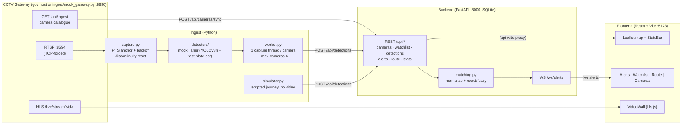

# Sentinel — Unified CCTV Integration & Vehicle Intelligence Platform

Prototype for the **Gujarat Police CCTV Hackathon 2026** (sentinel.gujarat.gov.in).

**Solution model: Hybrid — Model 1 + Model 2/4.**

- **Model 1 (mandatory): Camera Registry & GIS** — catalogue-driven onboarding of
  heterogeneous department cameras (Home/Police, GSRTC, Municipal Corporations,
  Panchayat, Health, RTO, Food & Civil Supplies), stored with geolocation and
  per-camera stream properties, rendered on a live GIS map.
- **Model 2/4: Unified viewing + central AI analytics + watchlist alerts** —
  live HLS previews and a video wall, PTS-correct stream ingestion, vehicle
  detection + ANPR, a watchlist continuously cross-referenced against live
  feeds with real-time WebSocket alerts, and **route reconstruction**: given a
  registration number, the platform presents the vehicle's complete
  timestamped, location-wise movement history on the map.

MVP analytics scope: **vehicle detection + ANPR + watchlist matching + route
reconstruction**. Face recognition, crowd analytics and anomaly detection are
documented as roadmap in [docs/HLD.md](docs/HLD.md) and are **not** implemented.

## Architecture



Ports: backend **8000**, frontend dev **5173**, mock gateway **8890**.
Env vars (all optional): `DATABASE_URL` (default `sqlite:///./sentinel.db`),
`SENTINEL_HOST` (default `http://localhost:8890`), `BACKEND_URL`
(default `http://localhost:8000`).

## Quickstart

Prerequisites: Python 3.12, Node 20, ffmpeg. No other system dependencies.

```bash
# One-time setup — venv at the project root
python3 -m venv .venv
.venv/bin/pip install -r backend/requirements.txt -r ingest/requirements.txt
(cd frontend && npm install)
```

Then run the demo (three terminals — or use `make backend` / `make frontend` / `make demo`):

```bash
./scripts/dev-backend.sh    # terminal 1 — backend on :8000 (also creates .venv if you skipped setup)
./scripts/dev-frontend.sh   # terminal 2 — frontend on :5173
./scripts/demo.sh           # terminal 3 — the full scripted demo
```

`scripts/demo.sh` walks the contract's six-step demo flow:

1. **Mock gateway up** — `ingest/mock_gateway.py` serves a realistic ~50-camera
   catalogue on :8890 (started in the background by the script).
2. **Backend up** on :8000 (you started it in terminal 1).
3. **Camera sync** — `POST /api/cameras/sync` pulls `{SENTINEL_HOST}/api/ingest`
   and upserts every camera (`source=catalogue`).
4. **Watchlist seed** — `python -m app.seed` adds ~6 entries including the demo
   plate `GJ01AB1234` and a fuzzy-bait plate (idempotent). The bait entry fires
   in every run: the simulator posts one `GJ01AB1Z39` sighting whose only
   watchlist match is that entry (fuzzy, 0.72).
5. **Simulated journey** — `ingest/simulator.py` replays a scripted vehicle
   route across ~8 cameras plus decoy plates: end-to-end alerts and route
   reconstruction with zero video/ML dependencies.
6. **Watch it in the browser** — open http://localhost:5173: live alerts appear
   in the Alerts tab; search `GJ01AB1234` in the Route tab to draw the
   timestamped route on the map.

Every simulated sighting carries a synthetic plate-crop JPEG, so alert cards,
route evidence thumbnails, and the dossier's Appendix A are fully populated.
Physics-filter showcases on demand:

```bash
# Classic rejected hop: an impossible mid-journey sighting ~385 km away
.venv/bin/python ingest/simulator.py --inject-teleport trailing
# Hostile variant: the impossible sighting comes FIRST — the route engine
# retro-rejects the poisoned anchor and keeps the true 8-camera route
.venv/bin/python ingest/simulator.py --inject-teleport leading
```

Both raise the watchlist alert (recall-first) stamped `physics-suspect` in the
alerts feed — the same verdict the route view shows, never a contradiction.

## Verification targets

```bash
make test        # backend regression suite: route physics (incl. leading-teleport
                 # retro-rejection), alert plausibility, fuzzy matching, dossier
                 # SHA-256 hash chain + tamper detection, append-only audit trail
make anpr-smoke  # proves the REAL video/ML path runs CPU-only with no external
                 # streams: CaptureLoop (PTS anchor, loop-discontinuity reset)
                 # + YOLOv8n + fast-plate-ocr on a synthetic clip; logs measured
                 # frame + inference rates  (needs: pip install -r ingest/requirements-ml.txt)
```

Every plate search, watchlist change, alert ack and dossier export lands in the
append-only audit log (`GET /api/audit`); the exported dossier cites its own
audit entry. Operator identity comes from the `X-Operator` header
(`SENTINEL_OPERATOR` env as fallback).

## Hackathon day: pointing at the real government gateway

The mock gateway exists only so the platform runs anywhere. Switching to the
official feed is configuration, not code:

```bash
# 1. Install the ML extras (torch/ultralytics/fast-plate-ocr live ONLY here)
.venv/bin/pip install -r ingest/requirements-ml.txt

# 2. Point the backend at the government host and restart it
export SENTINEL_HOST="http://<government-gateway-host>"
./scripts/dev-backend.sh

# 3. Re-sync the catalogue
curl -X POST http://localhost:8000/api/cameras/sync

# 4. Run the ingest worker with the real ANPR detector
cd ingest
BACKEND_URL=http://localhost:8000 SENTINEL_HOST="http://<government-gateway-host>" \
  ../.venv/bin/python worker.py --detector anpr --max-cameras 4
```

The worker re-syncs the catalogue itself on startup, pulls
`source=catalogue&status=live` cameras, and opens at most `--max-cameras`
RTSP-over-TCP captures (pace-the-load rule). Nothing about stream URLs is
hard-coded — every URL comes from the catalogue.

## Official gateway rules → where each is implemented

Every item of the portal's pre-submission checklist
([docs/INTEGRATION_NOTES.md](docs/INTEGRATION_NOTES.md)) maps to code:

| # | Checklist item | Implemented in |
|---|---|---|
| 1 | Every client forces RTSP over TCP | `ingest/capture.py` — sets `OPENCV_FFMPEG_CAPTURE_OPTIONS=rtsp_transport;tcp` **before** `import cv2` |
| 2 | No timing logic depends on `CAP_PROP_FPS` or frame arrival time | `ingest/capture.py` — all timing from `CAP_PROP_POS_MSEC` PTS; one wall-clock anchor per connection, `captured_at = anchor_wall + (pts − anchor_pts)`. `fps_declared` is stored informational-only (`backend/app/` Camera model) |
| 3 | Inter-frame gaps do not crash or stall the pipeline | `ingest/capture.py` — gaps are normal; only a PTS jump > 10 000 ms (or backwards PTS) triggers a re-anchor, never an abort |
| 4 | Reconnect with backoff implemented | `ingest/capture.py` — exponential backoff 2 s → 30 s (×2) on read failure; heartbeats to `POST /api/cameras/{id}/heartbeat` from `ingest/worker.py` |
| 5 | Decoder warnings on join are logged, not fatal | `ingest/capture.py` — mid-stream attach noise (`Error constructing the frame RPS`, `Could not find ref with POC`) is logged and ignored |
| 6 | Camera list and per-camera properties read from `/api/ingest` | `backend` `POST /api/cameras/sync` + `ingest/worker.py` (syncs, then reads cameras from the backend; no hard-coded URLs) |
| 7 | Pipeline handles mixed H.264/H.265 and mixed resolutions | catalogue codec/width/height stored per camera; one capture thread per camera in `ingest/worker.py` — no fixed-shape cross-camera batch |
| 8 | Behaviour is sane across a scene discontinuity | `ingest/capture.py` detects the PTS jump at the loop point, re-anchors, and calls `detector.reset()` (`ingest/detectors/base.py`) |

Also honored: **no footage downloads** (live capture only), **consume only**
(the platform never publishes to the gateway or touches its control API), and
**pace the load** (`--max-cameras`, default 4; captures closed on shutdown).

## Repository layout

```
backend/    FastAPI app — REST API, SQLAlchemy models, matching, WS hub, seed
ingest/     worker, PTS-correct capture, detectors (mock/ANPR), simulator, mock gateway
frontend/   React 18 + Vite 5 + Leaflet command-centre UI
scripts/    dev-backend.sh · dev-frontend.sh · demo.sh
docs/       CONTRACT.md · INTEGRATION_NOTES.md · HLD.md · SUBMISSION_CHECKLIST.md
```

## Documentation

- [docs/HLD.md](docs/HLD.md) — submission-grade High-Level Design: architecture,
  scalability to ~80 000 cameras, security, deployment, VAHAN/SARTHI/eGujCop
  readiness, cost-benefit.
- [docs/SUBMISSION_CHECKLIST.md](docs/SUBMISSION_CHECKLIST.md) — every hackathon
  deliverable with recording guidance. **Deadline: 7 September 2026.**
- [docs/CONTRACT.md](docs/CONTRACT.md) — internal module contract (source of truth).
- [docs/INTEGRATION_NOTES.md](docs/INTEGRATION_NOTES.md) — official gateway rules.
