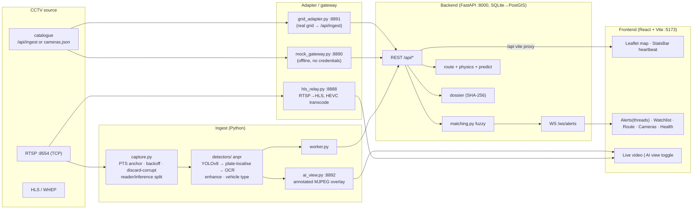

# SENTINEL — Unified CCTV Integration & Vehicle Intelligence Platform

Prototype for the **Gujarat Police CCTV Hackathon 2026** (sentinel.gujarat.gov.in).

**Plate to court in sixty seconds — on the cameras Gujarat already owns.**
SENTINEL integrates heterogeneous CCTV from 26 departments into one command
centre and turns a registration number into a court-ready answer: type a plate
and the platform reconstructs the vehicle's timestamped, location-wise route on
a GIS map, recovers OCR misreads with confusion-tolerant matching at displayed
confidence, visibly rejects physically impossible hops ("214 km/h — discarded
as false ANPR match"), fires live watchlist alerts, and exports a SHA-256
hash-chained chain-of-custody Evidence Dossier in one click.

It runs on live government feeds: it onboarded the full sandbox grid — **30
heterogeneous cameras (24 H.264 + 6 HEVC, five resolutions)** — via catalogue
sync and reads plates off them in real time, CPU-only. The 80,000-camera story
is edge-first arithmetic (1–3 Kbps of metadata per camera upstream, video never
leaves departmental DVRs, ₹3–7k per *existing* camera), not adjectives.

**Solution model: Hybrid — Model 1 (mandatory registry + GIS) + Model 2/4
(unified viewing + central AI analytics + watchlist alerts).**

---

## What it does

| Capability | Detail |
|---|---|
| **Camera registry + GIS** | Catalogue-driven onboarding (bulk / manual / API sync) of any vendor, codec, VMS; live map with department filter, status, health |
| **Live ingestion** | RTSP-over-TCP, PTS-anchored timestamps, backoff reconnect, loop-discontinuity reset, corrupt-packet discard, mixed H.264/HEVC |
| **AI analytics** | YOLOv8 vehicle detection → plate localisation → ANPR/OCR, all CPU-capable |
| **Plate enhancement** | Low-res plate crops upscaled + CLAHE + sharpened → legible close-up baked into every alert snapshot; also lifts OCR read rate |
| **Vehicle type** | Car / motorcycle / bus / truck classified per detection (COCO), badged on alerts and route sightings |
| **Watchlist + real-time alerts** | Continuous cross-referencing; sub-second WebSocket alert on a match; acknowledge + audit |
| **Confusion-tolerant matching** | Indian-plate canonicalisation + weighted OCR-confusion edit distance; every match carries confidence + the raw read |
| **Route reconstruction** | Search any plate → complete timestamped, location-wise route on the GIS map |
| **Physics plausibility filter** | Impossible inter-camera hops are greyed out with a plain-language reason and excluded from the route |
| **Intercept prediction** | From a route's heading + speed, forecast the next likely camera and ETA ("in ~4 min") — heuristic |
| **Alert threads** | One card per vehicle: OCR variants within a pass and returns on later passes grouped; expand to every sighting |
| **Retroactive re-scan** | Add a plate to the watchlist → correlate the last 24 h of sightings → raise alerts for past matches instantly |
| **Evidence dossier** | One-click SHA-256 hash-chained, tamper-evident PDF (chain of custody) — doubles as the timestamped output report |
| **Health board** | Per-camera measured fps, bandwidth, last-frame age, reconnects; a live "last read Ns ago" heartbeat |
| **Security / accountability** | Append-only, hash-chained audit trail; RBAC-lite token roles (viewer < operator < admin) |

MVP analytics scope: **vehicle detection + ANPR + watchlist + route
reconstruction + vehicle type**. Face recognition, crowd analytics and anomaly
detection are documented as roadmap in [docs/HLD.md](docs/HLD.md) and are **not**
implemented.

## Submission artifacts

| Artifact | Location |
|---|---|
| Master submission checklist + Apply-Now form answers | [deliverables/SUBMISSION_PACKAGE.md](deliverables/SUBMISSION_PACKAGE.md) |
| Presentation (12 slides, score-sheet-mirrored) | [deliverables/SENTINEL_Presentation.pptx](deliverables/SENTINEL_Presentation.pptx) |
| High-Level Design — PDF (mermaid rendered) | [deliverables/SENTINEL_HLD.pdf](deliverables/SENTINEL_HLD.pdf) (source [docs/HLD.md](docs/HLD.md)) |
| Workflow / integration diagrams | [deliverables/SENTINEL_Workflow_Integration_Diagram.pdf](deliverables/SENTINEL_Workflow_Integration_Diagram.pdf) |
| Government-feed output report (timestamped detections) | [deliverables/GOV_FEED_OUTPUT_REPORT.pdf](deliverables/GOV_FEED_OUTPUT_REPORT.pdf) |
| Live-demo runbook (recording script + proof-of-liveness) | [deliverables/LIVE_DEMO_RUNBOOK.md](deliverables/LIVE_DEMO_RUNBOOK.md) |
| Video shot scripts (own-feed + gov-feed) | [deliverables/VIDEO_SHOT_SCRIPTS.md](deliverables/VIDEO_SHOT_SCRIPTS.md) |
| Camera legibility ranking (live-grid soak) | [docs/CAMERA_RANKING.md](docs/CAMERA_RANKING.md) |
| Real-grid runbook | [docs/REAL_GRID.md](docs/REAL_GRID.md) — **deadline 7 Sept 2026** |

## Architecture



Ports: backend **8000**, frontend **5173**, mock gateway **8890**, real-grid
adapter **8891**, HLS relay **8888**, AI-view overlay **8892**.
Key env vars: `DATABASE_URL` (default `sqlite:///./sentinel.db`), `SENTINEL_HOST`
(catalogue host), `GRID_RTSP_AUTH` (`email:password` for the credentialed grid),
`SENTINEL_HIDE_DETECTORS` (default `simulator,mock` — hides non-live rows from
the alerts feed and stats; route search always sees all).

---

## Quickstart — offline demo (no credentials, runs anywhere)

Prerequisites: **Python 3.12, Node 20, ffmpeg**. Nothing else.

```bash
# one-time setup — venv at the project root
python3 -m venv .venv
.venv/bin/pip install -r backend/requirements.txt -r ingest/requirements.txt
(cd frontend && npm install)
```

Then, in three terminals:

```bash
./scripts/dev-backend.sh    # terminal 1 — backend :8000 (uses the mock gateway)
./scripts/dev-frontend.sh   # terminal 2 — dashboard :5173
./scripts/demo.sh           # terminal 3 — mock gateway + sync + seed + simulated journey
```

Open **http://localhost:5173**. Live alerts appear in the Alerts tab; search
`GJ01AB1234` in the Route tab to draw the timestamped 8-camera route on the map.
This mode uses `ingest/mock_gateway.py` (a realistic ~50-camera catalogue) and
`ingest/simulator.py` (a scripted journey) — no real cameras, no ML, no
credentials, fully reproducible.

Add the real ANPR/ML path (YOLO + OCR, CPU-only) with:

```bash
.venv/bin/pip install -r ingest/requirements-ml.txt
```

## Real government grid (credentialed)

The sandbox grid authenticates RTSP/WHEP with your **registered email + access
password** in the URL. The credential is read from your shell and never stored
in the repo, catalogue, or database. See [docs/REAL_GRID.md](docs/REAL_GRID.md).

```bash
# terminal 1 — catalogue adapter (serves the real grid's cameras on :8891)
.venv/bin/python ingest/grid_adapter.py --file ingest/grid_catalogue.json --port 8891

# terminal 2 — backend pointed at the adapter
./scripts/dev-backend-grid.sh
curl -X POST http://localhost:8000/api/cameras/sync   # once
(cd backend && ../.venv/bin/python -m app.seed)       # once

# terminal 3 — dashboard
./scripts/dev-frontend.sh

# terminal 4 — LIVE ANPR + relay in one launcher (prompts for the access
# password WITHOUT echo; verifies it against cam01 before starting anything)
MODE=video DEMO_CAMS=cam02 GRID_EMAIL=you@example.com scripts/live-with-auth.sh
```

`scripts/live-with-auth.sh` presets: `MODE=video` (one camera, faster analysis,
smoothest AI view) or `MODE=normal` (three cameras, multi-camera logs). Any
`DEMO_CAMS` / `INTERVAL_MS` / `RELAY_CAMS` env overrides. On hackathon day, skip
the adapter entirely: `export SENTINEL_HOST=http://<gov-host>` and sync their
`/api/ingest` directly — nothing about stream URLs is hard-coded.

Helpers: `ingest/loop_phase.py` reports which cameras are in a daylight/traffic
phase right now; `ingest/grid_probe.py --cam camNN` measures a camera's true
delivery rate.

## Verification

```bash
make test        # backend regression suite: route physics (incl. leading-teleport
                 # retro-rejection), alert plausibility, fuzzy matching, dossier
                 # SHA-256 hash chain + tamper detection, append-only audit trail
make anpr-smoke  # proves the REAL video/ML path runs CPU-only with no external
                 # streams: CaptureLoop (PTS anchor, loop-discontinuity reset)
                 # + YOLOv8n + plate-localiser + OCR on a synthetic clip
(cd frontend && npm run build)   # frontend production build
```

## Official gateway rules → where each is implemented

Every item of the portal's pre-submission checklist
([docs/INTEGRATION_NOTES.md](docs/INTEGRATION_NOTES.md)) maps to code:

| # | Checklist item | Implemented in |
|---|---|---|
| 1 | Every client forces RTSP over TCP | `ingest/capture.py` sets `OPENCV_FFMPEG_CAPTURE_OPTIONS=rtsp_transport;tcp\|fflags;discardcorrupt` before `import cv2` |
| 2 | No timing from `CAP_PROP_FPS` or arrival time | all timing from `CAP_PROP_POS_MSEC` PTS; one wall-clock anchor per connection |
| 3 | Inter-frame gaps don't crash/stall | gaps normal; only a PTS jump > 10 s (or large backward step) re-anchors, never aborts |
| 4 | Reconnect with backoff | exponential 2 s → 30 s; heartbeats to `POST /api/cameras/{id}/heartbeat` |
| 5 | Decoder warnings on join are non-fatal | FFmpeg kept at fatal-only log level; concealment frames gated out |
| 6 | Camera list + properties from `/api/ingest` | `POST /api/cameras/sync` + worker reads cameras from the backend; no hard-coded URLs |
| 7 | Mixed H.264/H.265, mixed resolutions | per-camera codec/size; one capture thread per camera; HEVC transcoded for the browser |
| 8 | Sane across a scene discontinuity | PTS jump at the loop point re-anchors and calls `detector.reset()` |

Also honored: **no footage downloads** (live capture only), **consume only**
(never publishes to the gateway), **pace the load** (`--max-cameras`).

## Repository layout

```
backend/    FastAPI — REST API, SQLAlchemy models, matching, route+predict, dossier, WS, audit, seed
ingest/     worker · capture (PTS/backoff/discard) · detectors (anpr enhance+type / mock) ·
            ai_view · hls_relay · grid_adapter · grid_auth · simulator · mock_gateway · loop_phase
frontend/   React 18 + Vite 5 + Leaflet — map, alert threads, route, AI-view toggle, health
scripts/    dev-backend[-grid].sh · dev-frontend.sh · demo.sh · live-with-auth.sh · export-*.py
docs/       CONTRACT.md · INTEGRATION_NOTES.md · HLD.md · REAL_GRID.md · CAMERA_RANKING.md
deliverables/  presentation · HLD PDF · diagrams · output report · runbook · shot scripts · screenshots
```

## Documentation

- [docs/HLD.md](docs/HLD.md) — High-Level Design: architecture, scalability to
  ~80,000 cameras, DR + rollout, security, deployment, VAHAN/SARTHI/eGujCop
  readiness, cost-benefit.
- [docs/REAL_GRID.md](docs/REAL_GRID.md) — running against the real sandbox grid.
- [docs/CONTRACT.md](docs/CONTRACT.md) — internal module contract (source of truth).
- [docs/INTEGRATION_NOTES.md](docs/INTEGRATION_NOTES.md) — official gateway rules.

---

## Run this project with an AI agent (Claude Code / Cursor / similar)

Clone the repo, open it in an AI coding agent, and paste the prompt below. It
runs the **offline demo** end to end — no cameras, no credentials, fully
reproducible. (The live government grid needs your personal access password,
which you must type yourself; the prompt tells the agent to stop and hand that
step to you.)

````text
You are running the SENTINEL CCTV platform (this repo) for me. Do all of this
yourself, reporting each step, and stop only if a command fails.

Environment: macOS/Linux, Python 3.12, Node 20, ffmpeg must be installed
(check with `python3 --version`, `node --version`, `ffmpeg -version`; if any is
missing, tell me and stop).

1. From the repo root, create the venv and install deps:
   python3 -m venv .venv
   .venv/bin/pip install -r backend/requirements.txt -r ingest/requirements.txt
   (cd frontend && npm install)
   Optional AI path (YOLO + OCR, CPU-only, larger download):
   .venv/bin/pip install -r ingest/requirements-ml.txt

2. Start three background processes (each in its own long-running shell; do NOT
   block on them) and wait for each port to answer:
   - Backend:  ./scripts/dev-backend.sh          -> wait for http://localhost:8000/api/stats to return 200
   - Frontend: ./scripts/dev-frontend.sh          -> wait for http://localhost:5173 to return 200
   - Demo:     ./scripts/demo.sh                  -> starts the mock gateway, syncs cameras,
                                                     seeds the watchlist, runs a simulated journey

3. Verify it works, and show me the evidence:
   - curl -s http://localhost:8000/api/stats                       (cameras synced, alerts > 0)
   - curl -s "http://localhost:8000/api/vehicles/GJ01AB1234/route" (a multi-camera route with stats)
   - Open http://localhost:5173 in a browser/preview and screenshot the map with alerts.

4. Run the test suites and report pass/fail:
   make test
   make anpr-smoke        (only if you installed requirements-ml.txt)
   (cd frontend && npm run build)

5. Tell me what to click: Route tab -> search "GJ01AB1234" for the vehicle route;
   Alerts tab for live watchlist alerts; Cameras tab -> a camera -> Live video / AI view.

Do NOT try to connect to the real government camera grid (103.250.160.189 /
cctv.corp8.cloud) — it needs my personal access password. If I ask for the live
grid, tell me to run:
   MODE=video GRID_EMAIL=<my-email> scripts/live-with-auth.sh
and enter the access password at the prompt myself. Never put that password in a
file, a command you echo, or a commit.
````
