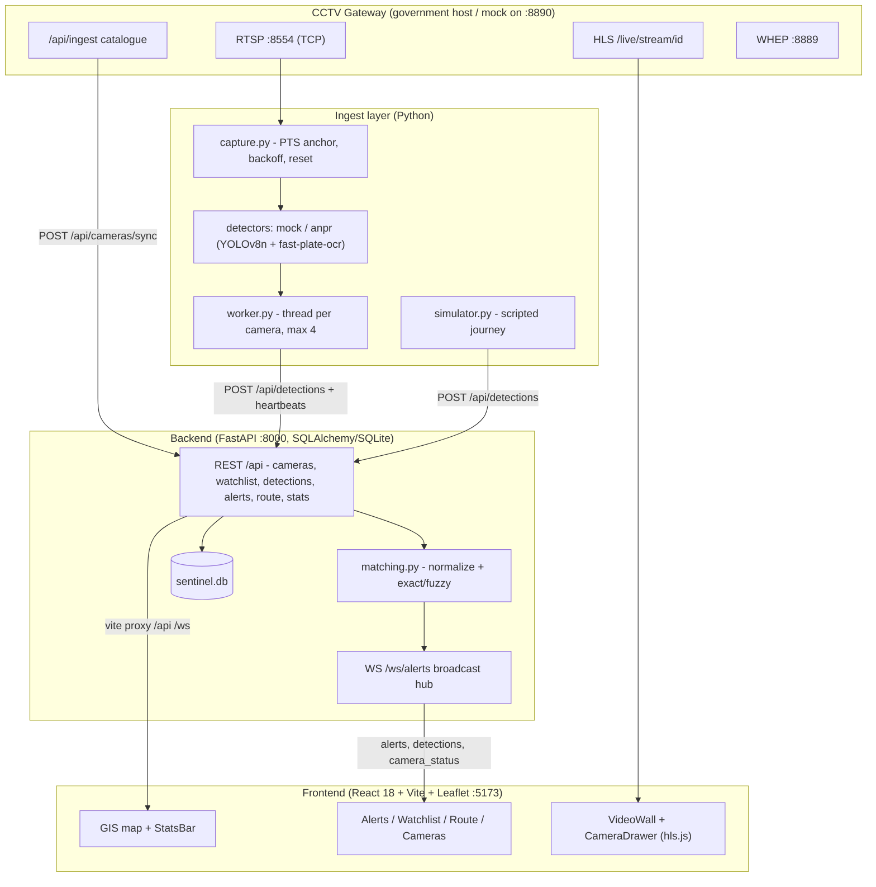
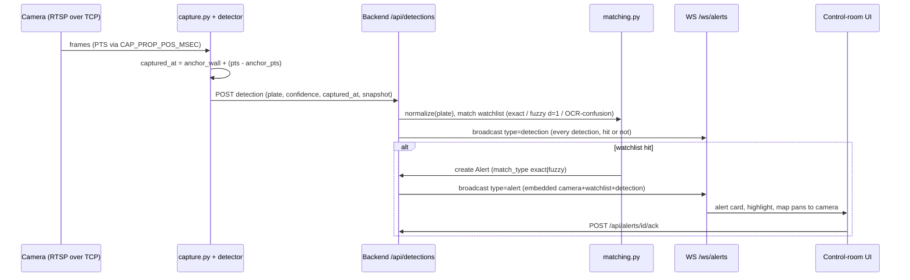
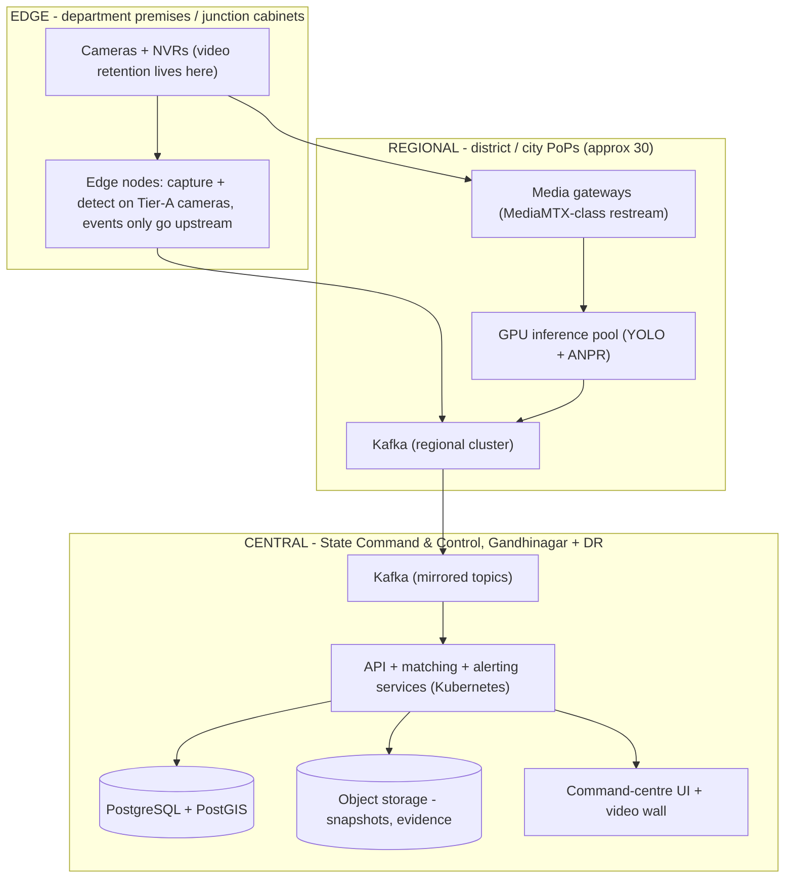

# Sentinel Platform — High-Level Design (HLD)

Gujarat Police CCTV Hackathon 2026 — submission document.

**Submitted by:** Divij Patel — Individual participant (Category 1) ·
vatsunp11@gmail.com

Solution model: **Hybrid — Model 1 (Camera Registry & GIS, mandatory) +
Model 2/4 (unified viewing, central AI analytics, watchlist alerts)**.

MVP analytics: vehicle detection + ANPR + watchlist matching + route
reconstruction. Face recognition, crowd analytics and anomaly detection are a
stated roadmap (Section 6.3), not part of the prototype.

---

## 1. Overall architecture

### 1.1 Prototype (what runs today)



Design decisions that matter:

- **The catalogue is the contract.** Nothing hard-codes stream URLs, camera
  ids, codecs or resolutions; everything is read from `GET /api/ingest` and
  upserted into the registry (`source=catalogue`, matched on `external_id`).
  Cameras and ids may change between syncs — upsert semantics absorb that.
- **One shared plate-normalization/matching rule** lives in exactly one place
  (`backend/app/matching.py`) so ingest, search and alerts can never disagree.
- **The ingest layer talks only to the backend REST API and to video streams.**
  It holds no database and can be scaled horizontally or moved to the edge
  without touching the backend.
- **`fps_declared` is informational only.** No timing logic anywhere derives
  from declared or measured frame rate (gateway hard rule 2).

### 1.2 Alert path (sequence)



---

## 2. Heterogeneous CCTV / VMS integration approach

The hackathon's core integration problem is that Gujarat's cameras belong to
many departments (Home/Police, GSRTC, Municipal Corporations, Panchayats,
Health, RTO, Food & Civil Supplies), bought from many vendors, behind many
VMSes. Sentinel's approach:

1. **Catalogue-driven onboarding (zero per-camera configuration).**
   `POST /api/cameras/sync` ingests the gateway catalogue: id, name,
   department, location, codec (H.264/H.265 mix), resolution, declared fps,
   live status and all three stream URLs. Sync is tolerant by design: unknown
   or extra fields are ignored, missing coordinates leave lat/lon null (the
   camera still exists in the registry, it is simply not mapped), and both the
   nested `location: {lat, lon}` shape and flat `lat`/`lon` fallback parse.
2. **Three transports, chosen per consumer**, all from the catalogue:
   - **RTSP over TCP (:8554)** — AI inference (forced TCP; UDP corrupts frames
     behind NAT/firewalls).
   - **WebRTC WHEP (:8889)** — sub-second browser preview where the network allows.
   - **HLS** — dashboards, mobile, restricted networks (used by the prototype
     UI: CameraDrawer previews and the VideoWall via hls.js).
3. **Manual + bulk-CSV onboarding** (`POST /api/cameras`,
   `POST /api/cameras/bulk`) for department cameras not yet behind the
   gateway — the registry accepts `catalogue`, `manual` and `csv` sources with
   a uniqueness constraint on (source, external_id).
4. **Per-camera property awareness.** Codec, width, height are stored per
   camera; capture and inference are sized per camera. There is deliberately
   **no uniform grid**: no fixed-shape inference batch across cameras (gateway
   hard rule 7).
5. **Status lifecycle.** Catalogue `live` flag on sync, then ingest heartbeats
   (`POST /api/cameras/{id}/heartbeat`) on connect/disconnect keep
   `status`/`last_seen_at` current; the map colours markers live/down/unknown
   and `camera_status` events push over WebSocket.

**VMS strategy at scale:** where departments run commercial VMSes (Milestone,
Genetec, Honeywell, Hikvision NVRs…), integration follows the same pattern the
government gateway proved: a thin per-VMS *catalogue adapter* exports the
camera inventory into `/api/cameras/sync` format, and streams are consumed via
the VMS's RTSP/ONVIF restreaming — the platform core never changes.

---

## 3. Stream ingestion & PTS-timing design

Timing is the part most platforms get wrong, and the gateway rules make it an
explicit evaluation point. Sentinel's capture design (`ingest/capture.py`):

- **TCP transport forced before decoder init**:
  `OPENCV_FFMPEG_CAPTURE_OPTIONS=rtsp_transport;tcp` is set in the environment
  *before* `import cv2`.
- **PTS is the only clock.** Per connection, on the first successfully decoded
  frame we record `(anchor_wall = utcnow, anchor_pts)`. Every frame is stamped
  `captured_at = anchor_wall + (pts − anchor_pts)`. This survives the
  gateway's buffered-GOP replay on join (first 1–2 s of frames arrive faster
  than real time): arrival-time stamping would produce impossible velocities
  after every (re)connect; PTS-offset stamping does not.
- **No constant-frame-rate assumption.** Inter-frame gaps are treated as
  normal delivery jitter. Only a *discontinuity* — PTS going backwards or
  jumping > 10 000 ms — triggers action: re-anchor the wall clock and call
  `detector.reset()` so trackers/background models recover from the loop
  point's hard scene cut (gateway hard rules 4 and 8).
- **Supervised reconnects.** Read failure → reconnect with exponential backoff
  2 s → 30 s (×2), never a tight loop; a `down` heartbeat is sent on
  disconnect and `live` on (re)connect. Decoder noise on mid-stream attach
  (`Error constructing the frame RPS`, `Could not find ref with POC`) is
  logged and non-fatal — the pipeline waits for the first IDR.
- **Load pacing.** Each client gets its own stream copy, so the worker opens
  only cameras it is actively processing (`--max-cameras`, default 4) and
  closes captures on shutdown. Live consumption only: no range-request
  downloads, no publishing, no control-API calls (rules 9–11).

End-to-end timestamp discipline: `captured_at` is **required** on every
detection, stored and returned as UTC ISO8601 with `Z`, and is the ordering
key for route reconstruction — so a route's point sequence reflects when the
vehicle actually passed each camera, not when packets happened to arrive.

---

## 4. Watchlist correlation & alert workflow

- **Watchlist**: plate (normalized), label (e.g. "Stolen vehicle — FIR
  123/2026"), category (stolen/wanted/suspect/blacklisted/other), priority
  (high/medium/low), active flag, notes. CRUD via `/api/watchlist`; managed in
  the UI's Watchlist tab.
- **Normalization** (single implementation, `backend/app/matching.py`):
  uppercase, strip everything except A–Z0–9. Applied identically at watchlist
  insert, detection insert, and search — Indian plates arrive as
  `GJ 01 AB 1234`, `GJ-01-AB-1234`, `gj01ab1234`; all collapse to one key.
- **Matching on every detection insert** (confusion-tolerant matcher): exact
  match on the normalized plate, plus **fuzzy** via a weighted edit distance —
  a substitution between an OCR-confusion pair (0↔O, 1↔I, 5↔S, 8↔B, 6↔G,
  2↔Z) costs 0.25 while any other edit costs 1.0, with total distance ≤ 1.0
  accepted — layered on Indian-plate-syntax canonicalization
  (`^[A-Z]{2}\d{1,2}[A-Z]{1,3}\d{4}$`, resolving confusion twins
  positionally; partial/nonstandard plates tolerated). Every match carries
  `match_confidence` (exact = 1.0; one confusion misread = 0.93) and
  `matched_from` (the raw OCR read), so the operator sees
  "matched GJ01A81234 → GJ01AB1234 (0.93)". Fuzzy results are always
  flagged — distinct plates are **never silently merged**. This is
  deliberate: ANPR under rain/night/angle misreads exactly these glyph
  pairs, and a stolen-vehicle system that only exact-matches silently loses
  those hits.
- **Alert lifecycle**: match → Alert row (`new`) → broadcast on `WS
  /ws/alerts` with embedded camera (id, name, lat/lon, department), watchlist
  (label, category, priority) and detection (captured_at, confidence,
  snapshot) → control-room card with snapshot + map pan → operator
  acknowledges (`POST /api/alerts/{id}/ack`, timestamped). Statuses:
  `new` → `acknowledged`; the roadmap adds assignment/disposition states tied
  to eGujCop case ids (Section 10).
- **Route reconstruction** (the hackathon test case):
  `GET /api/vehicles/{plate}/route` returns every sighting of the normalized
  plate (fuzzy hits included, flagged), ordered by `captured_at`, as both a
  point table (camera, department, lat/lon, timestamp, confidence, snapshot)
  and a GeoJSON LineString, with stats: first/last seen, cameras count,
  sightings count and haversine distance. The UI draws the polyline with
  numbered markers — timestamped location-wise movement history on the map.

### 4.1 Physics plausibility filter (route trust layer)

An aggressive-recall matcher needs a false-positive backstop, and string
similarity cannot provide one — but physics can. The route API models the
vehicle as an object moving through the world, not a string matching in a
database:

- For every pair of consecutive accepted sightings with coordinates the
  backend computes `leg_km` (haversine) and `implied_speed_kmh` =
  leg distance ÷ the `captured_at` delta (PTS-anchored timestamps, never
  arrival time — Section 3 — so reconnect replays cannot fabricate
  velocities).
- A hop implying **> 180 km/h** (> 250 km/h when the gap is under 60 s,
  where timestamp jitter dominates the small denominator) marks the **later**
  sighting `rejected: true` with a plain-language reason, e.g. *"implied
  speed 46170 km/h over 384.8 km in 30s — physically impossible, discarded
  as false ANPR match"*. Two reads within ~50 m (same junction) are always
  plausible regardless of timing.
- Rejected sightings are **still returned** — the UI greys them with the
  reason as tooltip, showing the operator what the system refused to believe
  and why — but they are excluded from the accepted polyline GeoJSON,
  `distance_km`, and route stats, and the leg chain is recomputed skipping
  them, so one false plate read cannot poison the legs around it.

The filter is the counterweight that makes recall-over-precision matching
(Section 4) safe: the matcher recovers misreads, the physics filter discards
the impossible ones, and both decisions are shown to the operator instead of
being taken silently.

### 4.2 Evidence dossier — chain of custody

CCTV evidence in India routinely dies between the control room and the
charge sheet. One click on a reconstructed route exports a court-oriented
**Evidence Dossier** (`GET /api/vehicles/{plate}/dossier.pdf`, with a
machine-verifiable twin at `.../dossier.json` that doubles as the mandatory
timestamped movement report):

- Case metadata (plate, generation time UTC, operator identity, watchlist
  entry with FIR reference), route statistics, and the full chronological
  sightings table — camera + department, GPS, timestamp, OCR confidence,
  match confidence with the raw read, and the accepted/rejected physics
  verdict with its reason (the dossier discloses what was discarded, not
  just what was kept).
- Embedded per-sighting snapshot frames, each bound by the SHA-256 of its
  raw JPEG bytes.
- A **SHA-256 hash chain**: a genesis hash over the case metadata, then each
  row hashed over its canonical JSON plus the previous row's hash, ending in
  a prominently printed final chain hash. Any post-export modification to
  any row, image, or the metadata changes every subsequent hash — tampering
  is detectable by recomputation from the JSON export alone, by any party,
  with no trust in the platform required.
- A chain-of-custody footer stating exactly that verification procedure.

Design provision, honestly scoped: this is tamper-*evidence* for the export
artifact (plus the append-only audit-trail roadmap for query provenance),
not a claim of certified forensic tooling.

---

## 5. AI analytics approach

### 5.1 Implemented now

| Stage | Model / method | Why |
|---|---|---|
| Vehicle detection | **YOLOv8n** (classes: car, truck, bus, motorbike) | Smallest YOLO that is production-credible; 640×640; real-time on modest GPUs and testable on CPU |
| Plate reading | **fast-plate-ocr** on detected-vehicle crops | Purpose-built lightweight ANPR OCR; avoids heavyweight OCR stacks |
| Correlation | normalized exact + fuzzy matching (Section 4) | Robust to standard ANPR misreads |
| Pipeline test path | `detectors/mock.py` motion-gated deterministic detector | Full pipeline verifiable with zero ML deps; clearly labeled mock |

The ML stack lives **only** in `ingest/requirements-ml.txt`; the default
install stays light (gateway-friendly and reviewer-friendly). The detector
interface (`detectors/base.py`: `process(frame, pts_ms, captured_at)` +
`reset()`) is the extension point — every future analytic is "another
detector" posting typed detections to the same API.

### 5.2 Accuracy posture

Every plate read carries `plate_confidence`; low-confidence reads are stored
(they still matter for route evidence density) but alerts surface confidence
and match type to the operator, and snapshots ride along as visual ground
truth. The human stays in the loop: analytics generate *leads*, operators
confirm.

### 5.3 Roadmap analytics (documented, not implemented)

- **Face recognition (FRS)**: as a detector plugin against a
  legally-authorized gallery, only under an SOP aligned with DPDP Act 2023 and
  MHA/NCRB AFRS guidance — deliberately out of MVP scope.
- **Crowd density / flow** for melas, rath yatra, election duty.
- **Anomaly detection**: wrong-way driving, loitering, abandoned objects,
  camera-tamper/blackout detection.
- **Vehicle attributes** (colour/type/make) to corroborate ANPR and support
  partial-plate searches.

---

## 6. Scalability: from 50 cameras to ~80,000

The prototype is single-node by design (SQLite, in-process WS hub, threaded
ingest). Statewide Gujarat is of the order of **80,000 cameras**. The
architecture scales by keeping the exact same contracts and swapping the
implementations underneath.

### 6.1 Three-tier topology



**The load-shaping insight: video never crosses the state backbone; events
do.** 80,000 streams at a 2 Mbps mean is ~160 Gbps aggregate — unshippable to
one site and pointless to ship. Inference runs at the edge/region; what goes
to Gandhinagar is detections (~1 KB metadata + ~50 KB snapshot).

### 6.2 Analytics tiering (assumption-driven)

| Tier | Cameras | Treatment |
|---|---|---|
| A — ANPR corridors (highway gantries, city entry/exit, major junctions) | ~20% ≈ 16,000 | Continuous vehicle detection + ANPR at ~5 fps analyzed |
| B — general surveillance | ~50% ≈ 40,000 | Motion-gated / on-demand analytics; registry + viewing always |
| C — registry & viewing only | ~30% ≈ 24,000 | GIS presence, live view, health monitoring |

### 6.3 GPU sizing (stated assumptions)

- Analyzed rate: **5 fps** per Tier-A camera (a vehicle pass lasts seconds;
  5 fps yields multiple reads per pass — full decode fps is not inferred fps).
- YOLOv8n @ 640×640, TensorRT FP16, batched on an **NVIDIA L4**:
  conservatively **600 inferences/s** per GPU.
- Per-GPU capacity: 600 / 5 fps = **120 cameras/GPU**.
- Tier A: 16,000 / 120 ≈ **134 GPUs** → provision **~160 L4s** (~20 % headroom
  + N+2 per region) ≈ **20 × 8-GPU 2U servers** spread over the regional PoPs.
- ANPR OCR runs only on vehicle-positive frames (~15 % of analyzed frames),
  ~2–3 ms per plate crop — absorbed by the same pool's headroom.
- Decode: hardware NVDEC on the same L4s (≈ 20+ 1080p H.264/H.265 decode
  sessions per GPU) plus CPU ffmpeg spillover; decode, not inference, is
  watched as the first bottleneck and is why analyzed fps ≠ stream fps.

### 6.4 Bandwidth (stated assumptions: 2 Mbps mean per stream)

**The edge-first arithmetic — computed, not asserted.** Shipping all video to
one centre:

```
80,000 cameras × 2 Mbps  =  160,000 Mbps  =  160 Gbps sustained backhaul
```

160 Gbps into a single site is unbuildable on GSWAN and pointless to build.
The edge-first alternative sends **detection metadata** upstream instead —
a plate event is ~200–600 bytes of JSON; at typical Tier-A event rates
(~2,000 reads/camera/day ≈ one every 43 s, plus heartbeats) that averages
**~1–3 Kbps per camera**:

```
80,000 cameras × 1–3 Kbps  =  80–240 Mbps statewide
160 Gbps ÷ 240 Mbps        ≈  a 650×–2,000× reduction
```

i.e. the entire state's ANPR event stream fits in less capacity than ~120
centrally viewed video streams. Video stays on departmental DVR/NVRs exactly
as today (snapshots ride along per event, ~50 KB, only when a detection
fires — the dominant term in Section 6.4's region→central row); decode and
inference run at the edge/regional tier on cameras Gujarat already owns. The
live per-feed Kbps counters on the camera-health board
(`GET /api/health/summary`) are the demo-visible form of this arithmetic.

| Path | Math | Result |
|---|---|---|
| Camera → regional PoP (Tier A) | 16,000 × 2 Mbps ÷ ~30 PoPs | ~1.1 Gbps per PoP |
| All-tier regional viewing capacity | 80,000 × 2 Mbps | 160 Gbps total, regional only |
| Region → central (events) | ~32 M detections/day × ~50 KB | ~1.6 TB/day ≈ 150 Mbps avg, ~1.2 Gbps at ×8 peak |
| Central video wall (on-demand HLS) | 200 concurrent operator streams × 2 Mbps | 400 Mbps |

(32 M/day = 16,000 Tier-A cameras × ~2,000 vehicle reads/day average.)

### 6.5 Platform evolution path (same contracts, bigger parts)

| Prototype component | Statewide replacement |
|---|---|
| SQLite | **PostgreSQL + PostGIS** (partitioned detections by day+region; PostGIS for real geo queries) |
| Direct `POST /api/detections` | **Kafka** topics (`detections.<region>`, mirrored centrally); the REST body becomes the message schema |
| In-process WS hub | WS gateway fed by a Kafka consumer group / Redis pub-sub |
| Threaded worker, `--max-cameras 4` | **Kubernetes** DaemonSet/Deployment per PoP; horizontal pod autoscaling; per-camera work-queue assignment |
| Base64 snapshots in DB | **S3-compatible object storage** (MinIO/cloud), URL-referenced from events |
| Single uvicorn | K8s Deployments behind an ingress LB, 3× replicas per service, active-active across two DCs |

Kafka is comfortable at this volume: ~370 events/s average, ~3,000/s peak —
a 3-broker regional cluster with RF=3 mirrors to central with capacity to
spare, and gives replay (rebuild the detection store), backpressure, and
fan-out (alerting, archival, analytics consumers) for free.

**Matching at scale (candidate blocking).** The prototype's route query scans
plate-bearing detections and scores each with the weighted-distance matcher in
Python — correct at demo scale, a full-table scan at 32 M detections/day. The
statewide design makes fuzzy lookup index-shaped instead of scan-shaped:

- Store **`plate_canonical`** (the positional confusion repair from
  `matching.py`) as its own **indexed column** next to the raw normalized
  plate; exact and canonical matches become two index lookups.
- Fuzzy candidates come from **candidate generation, not scanning**: expand
  the query plate's canonical form over the OCR confusion twins
  (0/O, 1/I, 5/S, 8/B, 6/G, 2/Z — bounded: ≤ ~2ᵏ variants for k confusable
  positions, in practice tens) and probe the index with the expansion set,
  plus a **length window of ±1** (a weighted distance ≤ 1.0 permits at most
  one insertion/deletion, so nothing outside the window can match). PostgreSQL
  **pg_trgm** (GIN) is the fallback for the residual single-edit cases the
  expansion set does not enumerate.
- Route queries then hit a composite **(plate_canonical, captured_at)** index —
  time-windowed by the partition scheme in §6.5 — and only the surviving
  candidates (typically < 10² rows) reach the Python scorer, whose ranked
  confidences and physics filter are unchanged.
- Watchlist matching at detection time is bounded the same way: the active
  watchlist is held in memory keyed by canonical form (a few thousand entries),
  and each incoming read probes its own confusion expansion against that map —
  O(expansion) per detection, independent of watchlist growth.

The prototype already ships the first step of this path: the route query
applies the ±1 length-window pre-filter in SQL before any Python scoring
(`backend/app/routers/routes.py`), so the contract holds by narrowing
candidates, not by scanning harder.

### 6.6 Retention (hot / warm / cold)

| Layer | Where | Keeps | Duration (policy-configurable) |
|---|---|---|---|
| Hot | Central PostgreSQL + NVMe | Full detection metadata + snapshot refs | 7 days (~12 TB) |
| Warm | Object storage, IA class | Events + snapshots, queryable | 90 days (~150 TB) |
| Cold | Archive tier | Alert-linked evidence bundles (case-flagged data exempt from purge) | 1 year+ per SOP |
| Video | Department NVRs at the edge | Continuous footage | 15–30 days per department norms |

Continuous centralized video storage is explicitly **rejected**: 80,000 × 2
Mbps ≈ 1.7 PB/day (~52 PB/month) buys little investigative value over
event-indexed retrieval from edge NVRs plus alert-triggered clip export.

### 6.7 High availability & disaster recovery

Recovery objectives (stated targets, per tier):

| Tier | Failure | Mechanism | RPO | RTO |
|---|---|---|---|---|
| Feed | Camera/stream drop | Backoff reconnect (2→30 s), health board alarm | — (live source) | ≤ 30 s reconnect cycle |
| Edge | District box loss | Stateless analytics; spare-pool box; cameras rebalanced by the registry | ≤ 60 s of detections | ≤ 30 min swap |
| Edge | WAN partition | Store-and-forward: detections buffered locally (≥ 72 h) and replayed with original PTS-derived timestamps — no evidence loss, no fabricated times | 0 (buffered) | Automatic on link restore |
| Regional | GPU node loss | N+1 capacity, camera assignments rebalanced | 0 | ≤ 5 min |
| Central | Database loss | PostgreSQL streaming replication, promote standby | ≤ 60 s (async WAL) | ≤ 15 min |
| Central | Site loss | Active–passive across two state data centres (primary SDC + DR site); object storage cross-replicated; Kafka mirrored | ≤ 5 min | ≤ 60 min, alerts degrade to region-local delivery meanwhile |

Backups: nightly full + continuous WAL archiving, 30-day cycle, quarterly
restore drills as SOP. The append-only audit chain's daily hash anchor is
copied to immutable storage, so tampering **across restores** is detectable —
DR that preserves chain-of-custody, not just data.

Departmental NVR footage keeps its existing departmental DR posture: the
platform adds no new single point of failure to video retention (Model 2
principle — source systems remain independent).

### 6.8 Statewide rollout plan (phased)

| Phase | Scope | Cameras | Key gates |
|---|---|---|---|
| 0 (wk 0–8) | PoC hardening at SCRB; registry (Model 1) opened **statewide from day one** — metadata onboarding costs no bandwidth | ~500 live (Gandhinagar + Ahmedabad) | Read-rate & uptime KPIs on live feeds; security audit |
| 1 (mo 3–6) | One full police range; ANPR on high-value corridors; operator SOPs, training, 24×7 helpdesk | ~5,000 | Range CP sign-off; alert-to-action drill |
| 2 (mo 6–12) | Four ranges; regional edge sites live; VAHAN / eGujCop adapters in production | ~25,000 | Cross-range route reconstruction exercise |
| 3 (mo 12–24) | Statewide incl. Junagadh, Somnath, Dwarka and border districts; permitted private/society cameras via viewing-only onboarding | ~80,000 | State review; DR failover drill |

Each department joins with the **onboarding kit**: the prerequisites form
(section 9), a network checklist, and the camera-metadata CSV template — the
same format the registry's bulk import already accepts today, so Phase 0 needs
no new tooling.

---

## 7. Cybersecurity

- **Transport security**: TLS 1.3 on every north-south interface (UI, API,
  HLS); mutual TLS between services and for edge-node → Kafka; SRTP/TLS for
  WebRTC. Camera-to-gateway legs that cannot do TLS are isolated on
  camera VLANs and wrapped at the media gateway.
- **AuthN/AuthZ**: OIDC SSO (department identity provider integrable), MFA
  for control-room and admin roles. **RBAC**: Viewer (live view only),
  Operator (ack alerts, run route queries), Supervisor (watchlist CRUD,
  exports), Administrator (camera registry, users) — scoped by
  district/commissionerate so an operator sees their jurisdiction by default.
- **Network segmentation**: camera VLAN → media/ingest DMZ → application zone
  → data zone, with one-way event flow enforced at each boundary; state
  backbone over GSWAN; no camera network route to the internet.
- **Audit trail**: every watchlist change, route/plate query, alert
  acknowledgement, export and login is logged append-only (who, what, when,
  from where). Plate searches are themselves sensitive queries — auditing
  them deters misuse and satisfies court scrutiny of evidence handling.
  **Implemented in the prototype**: the `audit_log` table (insert-only —
  no update/delete path exists in the codebase) records every route query,
  watchlist create/update/delete, alert acknowledgment and dossier export
  with operator identity and canonical-JSON parameters; `GET /api/audit`
  exposes it, and each Evidence Dossier cites its own export entry
  ("this export is entry N of the audit log") plus the recent audit rows
  for the queried plate. **RBAC-lite is implemented too**: setting
  `SENTINEL_TOKENS` ("token:name:role,...") turns on a three-role token gate
  (viewer < operator < admin) enforced on watchlist mutations, alert
  acknowledgment and dossier export, and operator identity on audit rows and
  the dossier then comes from the authenticated token — never from the
  spoofable `X-Operator` header (which is honoured only in the open demo
  mode, when auth is off). Production replaces the static token map with the
  OIDC/RBAC layer above; key management and IAM integration remain design
  provisions.
- **Privacy safeguards (DPDP Act 2023 posture)**: purpose limitation (vehicle
  analytics for law-enforcement use), data minimization (plate crops and
  bounded snapshots, not continuous central video), retention limits with
  automated purge (Section 6.6) and case-flag exemptions, no FRS in MVP,
  need-to-know access via RBAC, and documented SOPs for watchlist entry
  (traceable to an FIR or lawful order — the label field carries the
  reference).
- **Supply chain / hardening**: pinned dependencies, containers from minimal
  base images, no credentials in the repository (env-injected secrets;
  Kubernetes secrets/vault in production), consume-only gateway posture.

---

## 8. Deployment architecture

**Prototype** (this repository): single host — uvicorn :8000, Vite :5173,
mock gateway :8890, SQLite file; `scripts/demo.sh` orchestrates the demo.
Runs on macOS/Linux with Python 3.12, Node 20, ffmpeg only.

**Production**:

- **Regional PoPs (~30)**: media gateway + GPU inference nodes + Kafka,
  co-located with district data centres; sized ~1 Gbps ingest each.
- **Central (State C&C, Gandhinagar)**: Kubernetes cluster (3+ control, 10+
  worker nodes), PostgreSQL+PostGIS HA pair, 3-broker Kafka, object storage,
  observability stack (Prometheus/Grafana/Loki), WS gateway fleet.
- **DR**: second site, active-active for stateless services, async replica
  for PostgreSQL, mirrored Kafka; RPO ≤ 5 min, RTO ≤ 30 min for the API tier.
- **Rollout**: containerized services, GitOps deployments, canary per region.
- **Health**: camera heartbeats surface per-camera up/down on the GIS map;
  per-PoP stream-health dashboards; synthetic probes replay a reference
  stream through the full pipeline hourly.

---

## 9. Department prerequisites & assumptions

| # | Prerequisite | Why |
|---|---|---|
| 1 | Cameras reachable via the state gateway (or a per-VMS catalogue adapter), RTSP/HLS restream enabled | Catalogue-driven onboarding (Section 2) |
| 2 | Accurate geolocation per camera in the catalogue | GIS map, route reconstruction; null coords degrade to registry-only |
| 3 | Uplink budget ~2–4 Mbps per streamed camera to its PoP | Bandwidth model (Section 6.4) |
| 4 | NTP discipline on gateway/media servers | PTS anchoring assumes a sane server clock at connection time |
| 5 | Department NVR retention ≥ 15 days | Video stays at the edge; platform indexes events into it |
| 6 | Firewall rules: camera VLAN → PoP only; PoP → central events only | Segmentation model (Section 7) |
| 7 | Nodal officer per department for onboarding + outage triage | Operational ownership of camera health |
| 8 | SOP for watchlist entries (FIR/lawful-order reference mandatory) | Legal defensibility of alerts (Section 7) |
| 9 | Power/UPS at junction cabinets per PWD/municipal norms | Camera uptime dominates real-world recall |

Assumptions used in the numbers: 2 Mbps mean bitrate, 20 % Tier-A share,
5 fps analyzed, 600 inf/s per L4, ~2,000 reads/day per Tier-A camera. Each is
individually tunable; sizing scales linearly with each.

---

## 10. VAHAN / SARTHI / eGujCop integration readiness

The backend is structured for an **API-adapter pattern**: each external system
gets a thin adapter with a typed interface, env-configured base URL and
credentials, and a mock implementation for development. **No real credentials
or government endpoints exist in this repository** — production access
requires the department's MoU/keys via NIC eTransport and SCRB channels.

| System | Trigger | Enrichment | Direction |
|---|---|---|---|
| **VAHAN** | Alert raised / route searched | Owner name, registered address, vehicle class/colour/chassis status (stolen flag corroboration) | Read-only lookup, audit-logged |
| **SARTHI** | Investigation view | Licence linkage for identified drivers | Read-only lookup, audit-logged |
| **eGujCop** | Watchlist entry / alert disposition | Pull: FIR-linked wanted-vehicle lists auto-populate the watchlist. Push: acknowledged alerts file as case events under the referenced FIR | Two-way, queued via Kafka |

Readiness in the current design: the watchlist `label`/`notes` fields already
carry FIR references; alerts already embed everything an eGujCop case event
needs (camera, geo, timestamp, snapshot, confidence); plate normalization
matches VAHAN's registration format after the same strip rule. Adapter calls
are made asynchronously after alert creation so an external outage can never
delay a real-time alert.

---

## 11. Cost-benefit sketch (indicative, hardware-focused)

Assumptions as in Section 6; commodity pricing, ±30 %.

| Item | Qty | Indicative cost |
|---|---|---|
| GPU inference servers (8× L4, 2U) | 20 | ₹ 7–9 crore |
| Regional PoP compute/network (30 sites) | 30 | ₹ 3–4 crore |
| Central cluster + storage (incl. DR share) | 1+DR | ₹ 4–6 crore |
| Software | — | Open-source core; integration + support contract |
| **Indicative capex** | | **₹ 15–20 crore** (excl. cameras/NVRs — departments already own these) |

Phasing: **P1 pilot** — one commissionerate, ~2,000 cameras, 2 PoPs
(~₹ 1.5 crore, validates every ratio above) → **P2** four municipal-corporation
cities → **P3** statewide.

Benefit drivers (order-of-magnitude): vehicle trace time collapses from
days of manual NVR review to minutes (one 8-camera route review ≈ 8–16
operator-hours manually vs a sub-second query); continuous watchlist coverage
across all Tier-A corridors vs human monitoring practical over only a few
dozen screens per shift; measurable deterrence and recovery uplift on
stolen-vehicle cases; the same infrastructure amortizes across future
analytics (crowd, anomaly, tamper) at software-only marginal cost.

---

## 12. Traceability

- Module contract: [CONTRACT.md](CONTRACT.md)
- Official gateway rules honored by ingest: [INTEGRATION_NOTES.md](INTEGRATION_NOTES.md)
  (see README for the rule-by-rule file mapping)
- Deliverables status: [SUBMISSION_CHECKLIST.md](SUBMISSION_CHECKLIST.md)
