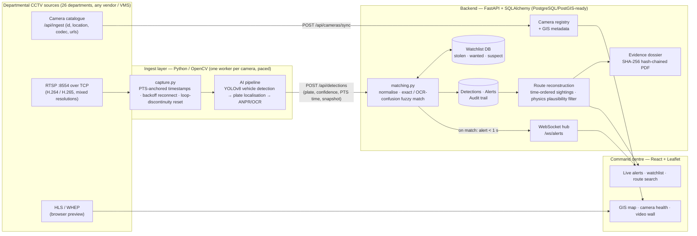
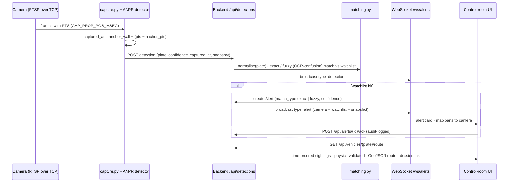
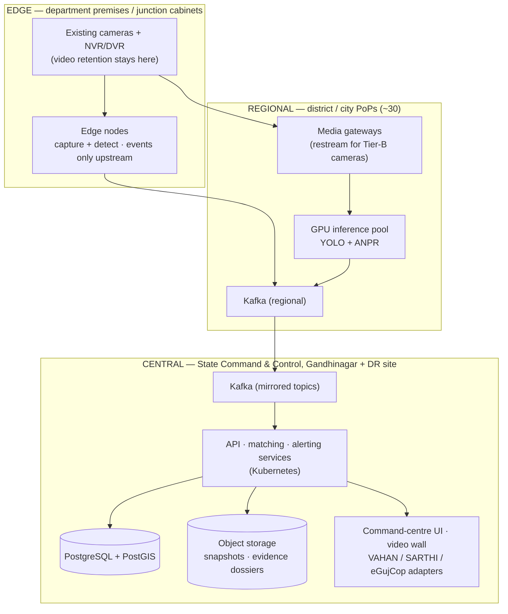

# SENTINEL — Workflow & Integration Diagram

**Gujarat Police CCTV Hackathon 2026 · Unified CCTV Command Platform · Divij Patel**

Three views of one system: (1) the end-to-end integration workflow as built and demonstrated on the live sandbox grid, (2) the real-time detection → watchlist → alert sequence, and (3) the statewide three-tier deployment topology scaling the same contracts to ~80,000 cameras.

---

## 1. End-to-end integration workflow (as built)

Heterogeneous departmental cameras are onboarded from a catalogue (the contract), consumed read-only over RTSP/HLS with no change to existing VMS or storage, analysed live (vehicle detection → plate localisation → ANPR), correlated against the watchlist, and surfaced on the GIS command centre with route reconstruction and evidence export.

---

## 2. Real-time detection → watchlist → alert sequence

---

## 3. Statewide deployment topology (~80,000 cameras, edge-first)

Video never leaves departmental storage; only detection metadata (~1–3 Kbps per camera) travels upstream. The same API contracts run at every tier.

